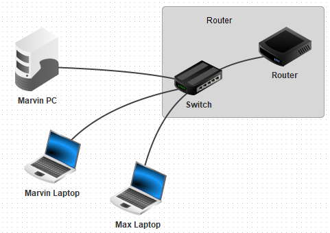
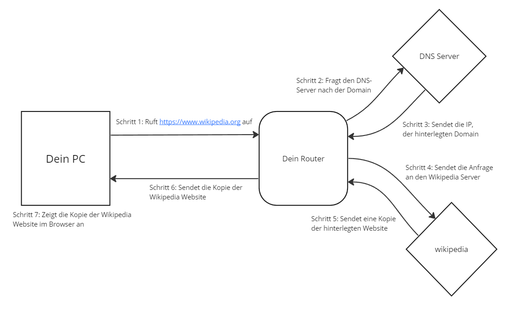

# Was ist das Internet?

Bevor wir uns nun aber anschauen, wie die Webentwicklung funktioniert, ist es für das Verständnis deutlich einfacher, das Internet grundlegend zu erklären. Die Betonung liegt auf _grundlegend_, da dies kein Buch über die Netzwerktechnik ist. Dieser Abschnitt dient nur dazu, dich auf ein Level zu bringen, bei dem du verstehst, wie dein Browser funktioniert. Solltest du beim ersten Lesen noch nicht alles verstehen, ist dies vollkommen normal. Lies diesen Teil des Kapitels in der Zukunft noch einmal, und ich werde dir versprechen, dass du ein besseres Verständnis für die Thematik erhalten wirst.   
Das Internet ist erst einmal ein Netzwerk. Dieses ist ein Zusammenschluss aus mindestens 2 Geräten, die sich Daten senden und diese empfangen. Das Internet ist das größte Netzwerk, womit jedes internetfähige Gerät meist verbunden sein sollte. 
## Der Router
Internetfähige Geräte sind mit einem Router von deinem Provider verbunden, die zum Internet führen. Dies kann man sich folgendermaßen  vorstellen:  
  
Nun fragst du dich vielleicht, weshalb ich einen Switch und einen Router zu einem Router zusammengefasst habe. Dies liegt daran, dass wir in unserem alltäglichen Sprachgebrauch ein _Kombipaket_, von Switch, Router und mehr, als einen Router bezeichnen.  
Ein kleines Beispiel hierzu: Wir alle kennen eine Fritz!Box. Diese bezeichnen wir im alltäglichen Sprachgebrauch, als den _Router_. Dabei ist in diese Fritz!Box eine Kombination aus mehreren kleineren Geräten, wie ein Switch und dem eigentlichen Router, der für die Verbindung zum Internet zuständig ist.
## IP Adressen
Jeder dieser Geräte trägt eine private IP-Adresse, die in dem Netzwerk nur einmal existiert. Dabei sind alle Geräte aus dem _Internet_ ausgeschlossen. Bedeutet, dass mein PC die gleiche private IP-Adresse haben kann, wie dein PC, der in einem anderen Netzwerk, an einem anderen Ort steht. Da wir uns nicht im gleichen Netzwerk befinden, kann es dadurch auch nicht zu Komplikationen kommen. Ein Problem kann es erst werden, wenn 2 Router die gleiche IP-Adresse besitzen. Dies ist nämlich unsere öffentliche IP-Adresse. Diese können wir beispielsweise auf Internetseiten, wie https://www.wieistmeineip.de herausfinden.
## DNS Server
Ein **D**omain-**N**ame-**S**ystem Server, ist grundlegend für die Umwandlung von Domains in IP-Adressen zuständig. Domains, wie _wikipedia.org_ wurden erstellt, da wir Menschen uns deutlich einfacher Namen, statt wirr lose Zahlenfolgen merken können. In so einem DNS-Server ist die Domain und die dazugehörige IP gespeichert. 
Ein Beispiel dazu: Für die Domain youtube.com ist die IP-Adresse 208.65.153.238 hinterlegt. Sollten wir nun eine Anfrage an youtube.com senden, wird diese zuerst zum DNS-Server geleitet. Dieser sorgt dafür, diese Domain in die IP-Adresse 208.65.153.238 umzuwandeln. Erst dann weiß die Anfrage, zu welchem Server diese geschickt werden soll.
## Der Datenaustausch
Ich möchte nun den Datenaustausch zwischen 2 Geräten im Internet verdeutlichen. 
Du gibst im Browser _https://www.wikipedia.org_ ein.
Das _s_ in _http**s**_ steht dabei für eine verschlüsselte Verbindung, auf die ich nicht weiter eingehen werde, da dies für dieses Buch unwichtig ist. Wichtig ist nur, dass _https://_ für das **H**yper-**T**ext-**T**ransport-**P**rotocol steht, welches im Webbrowser üblich ist. Gelegentlich sieht man auch _http://_ vor einer Domain, welche für eine unsichere Verbindung steht. Dabei können Hacker, die zwischen dir und dem Ziel der Anfrage stehen, alle Daten mitlesen.  Diese Anfrage wird zuerst zu deinem Router gesendet, der diese Anfrage mit der öffentlichen Domain zu einem DNS-Server schickt. Ist nun klar, welche IP-Adresse sich hinter der Domain verbirgt, wird diese Anfrage zu dem Server gesendet, der meist eine Antwort zurück zum Router schickt. Der Router sendet diese Anfrage nun wieder zu dir und du bekommst beispielsweise eine Webseite angezeigt. Wichtig zu erwähnen ist auch, dass diese Webseite nur eine Kopie der richtigen Webseite auf dem Wikipedia Server darstellt. Die Webseite, die du am Ende siehst, ist nur eine Kopie und kann lokal auch komplett verändert werden. Dies ändert aber nichts an der Website, die auf dem Server liegt.  
Hier nochmal eine grafische Abbildung einer Browseranfrage: 

[Zurück](./1.1%20Was%20ist%20dieses%20Buch.md) |
[Inhaltsverzeichnis](../README.md) 