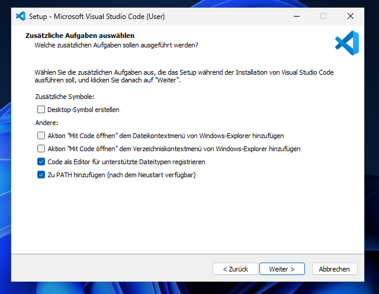
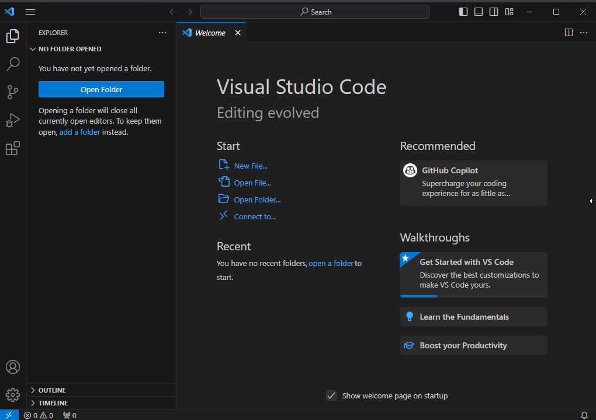

# Benötigte Software
Nachdem wir uns nun grundlegend angeschaut haben, welche Sprachen wir für die Webentwicklung benötigen, schauen wir uns nun an, welche Software wir nutzen, um mit HTML, CSS und Javascript eine Webseite zu erstellen.
## Nr. 1 - Der Browser
Um in die Webentwicklung zu starten, brauchen wir vorerst einen Browser. Dabei ist es grundlegend egal, welchen man hierbei nutzt. Zu empfehlen sind aber aktuelle Browser, die auf der Basis von Chromium laufen. Diese sind beispielsweise:
- [Chrome](https://www.google.com/chrome/de/download-chrome/)
- [Opera](https://www.opera.com/de)
- [Opera GX](https://www.opera.com/de/gx)
- [Microsoft Edge](https://www.microsoft.com/de-de/edge/download)
- ...

Ein Browser, der nicht auf Chromium basiert, aber auch einen guten Browser für die Webentwicklung darstellt, ist [Firefox](https://www.mozilla.org/de/firefox/new/).  
Grundlegend kann man also sagen, dass es wichtig ist einen aktuellen Browser zu nutzen. Welchen man genau nutzt, ist in der heutigen Zeit irrelevant, da alle Browser in den meisten Fällen alle möglichen Funktionen bereitstellen. Zu empfehlen ist jedoch ein Browser, den deine Zielgruppe am meisten nutzt, um wirklich sicherzustellen, dass alles so aussieht und funktioniert, wie es soll. Daher ist [Chrome](https://www.google.com/chrome/de/download-chrome/) in aller Regel der Browser, der für die Webentwicklung am geeignetsten ist.

## Nr. 2 - Der Texteditor
Um unseren Code zu schreiben, nutzen die meisten Entwickler einen Texteditor, der ihnen das Schreiben von Code einfacher machen lässt. Ein Texteditor kann dabei Features, wie _Syntax Highlighting_, Code Vervollständigung, Fehleranzeige und vieles mehr bereitstellen. In der Webentwicklung gibt es einige Texteditoren, die im Grunde für das Gleiche sorgen, jedoch von dem Funktionsausmaß sich unterscheiden.  
Die meisten Webentwickler setzen jedoch auf [Visual Studio Code](https://code.visualstudio.com) von Microsoft, da der Funktionsumfang dieses Editors grundlegend erst einmal klein ist, jedoch mit _Erweiterungen_ so stark verändert werden kann, sodass bei jedem Entwickler der Editor anders aussieht und/oder auf andere Bereiche spezialisiert ist. So hat ein Javascript Entwickler Erweiterungen installiert, die das Schreiben von Javascript erleichtern, wobei ein PHP Entwickler Erweiterungen installiert hat, die das Schreiben von PHP erleichtern.  
Solltest du also [Visual Studio Code](https://code.visualstudio.com) noch nicht auf deinem PC installiert haben, so lade diesen Editor jetzt herunter! 

### Installation von Visual Studio Code
Nachdem wir nun den Installer heruntergeladen, die Vereinbarungen akzeptiert, den Zielordner ausgewählt und den Startmenü-Ordner so akzeptiert haben, wie er ist, erscheint nun dieses Fenster, welches nicht direkt mit "Weiter" bestätigt werden sollte:
  
Hierbei ist es wichtig, dass ein Haken bei "Zu PATH hinzufügen" gesetzt wird. Der Rest ist optional. Haben wir nun Visual Studio Code erfolgreich heruntergeladen und geöffnet, erscheint dieses Fenster:

Hier können wir nun einen beliebigen Ordner öffnen, in dem unsere Projektdateien gespeichert sind. Wie genau man jedoch damit arbeitet, klärt sich im späteren Verlauf.