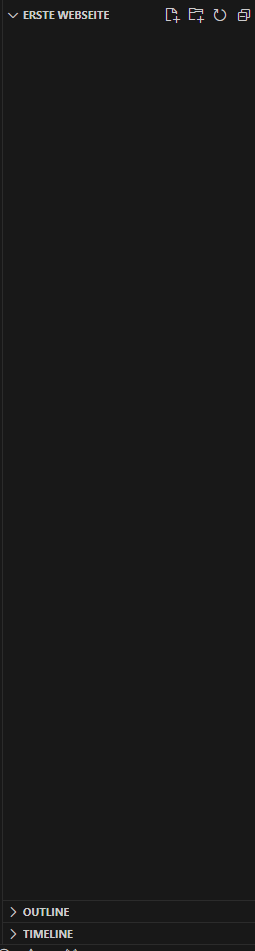

# Die erste Website
Nachdem wir nun ein ganzes Kapitel lang nicht eine Zeile Code geschrieben haben, ist es jetzt an der Zeit dies zu tun. In diesem Unterkapitel lernst du, wie du mit HTML deine allererste Webseite erstellst. Dabei erkläre ich dir Schritt für Schritt, was zu tun ist. Wenn du jedoch nicht weiter kommst, denk an das [Kapitel 1.5](../1.%20Kapitel/1.5%20Was%20tun%20bei%20Problemen.md) und schaue dir den Schritt noch einmal genau an und kontrolliere jedes einzelne Zeichen. Oft ist nämlich das Problem, dass einzelne Zeichen verkehrt geschrieben werden! 

## Schritt 1: Erstelle ein Projektordner
Ein Projektordner ist ein ganz normaler Ordner auf deiner Festplatte, worin alle erforderlichen Dateien enthalten sind. Um es uns ganz einfach zu machen, erstellen wir einen Ordner auf dem Desktop, den wir "Erste Webseite" nennen. 
 
Nun öffnen wir _Visual Studio Code_. Dies sollte ungefähr so aussehen: 
 
Hier klicken wir oben links auf "File" und in dem Untermenü auf "Open folder..." 
 
Es öffnet sich der Explorer. Hier wählst du deinen Ordner aus. Es erscheint auf der linken Seite die Ordneransicht. 
 

## Schritt 2: Index.html erstellen
Auf der rechten Seite des Ordnernamens siehst du Aktionsbuttons. Hier klickst du auf den Button "New File...", und nennst diese Datei "index.html". Du könntest diese auch "seite.html" nennen. Jedoch ist die _index.html_ die Datei, die zuerst angesteuert wird, wenn wir den Ordner auf einem Webserver hochladen und auf die Seite zugreifen.
Ein kleines Beispiel dazu: 
Wir gehen im Internetbrowser auf _https://www.youtube.com_. Im Hintergrund wird auf die index.html Datei zugegriffen. Bedeutet, dass wir im Hintergrund nicht _https://www.youtube.com_, sondern _https://www.youtube.com/index.html_ aufrufen. Da diese jedoch standardmäßig aufgerufen wird, brauchen wir diese nicht hinzufügen. Hätte YouTube ihre HTML-Datei jedoch seite.html genannt, müssten wir eigenhändig immer _https://www.youtube.com/seite.html_ eingeben. Daher nennen wir unsere erste HTML-Datei **immer** index.html. 
Haben wir die Datei jetzt benannt, öffnet sich diese direkt in Visual Studio Code: 
 

## Schritt 3: Index.html bearbeiten
Hier können wir nun unsere _index.html_ Datei bearbeiten. Hierfür starten wir am leichtesten, indem wir einen beliebigen Text hinzufügen. Beispielsweise "Hallo Welt! Dies ist meine erste Webseite!".  
 
Speichern wir nun die Datei mit _Strg + S_, können wir diese öffnen. Hierfür gehen wir zurück zu unserem Desktop, öffnen den Ordner und öffnen die _index.html_ mit einem Doppelklick. Es startet sich dein Standardbrowser mit der erstellten Seite. 

Sollte dies nicht der Fall sein, achte darauf, dass du die Datei gespeichert hast! Ob die Datei nicht gespeichert ist, erkennst du an dem Symbol rechts neben dem Namen. Ist dort ein X zu sehen, ist die Datei gespeichert. Ist dort ein Kreis zu sehen, ist die Datei nicht gespeichert. 

Datei nicht gespeichert: 
 
Datei gespeichert: 
 

Wenn sich nicht dein gewollter Browser geöffnet hat, dann achte darauf, dass du deinen Standardbrowser richtig eingestellt hast. Wie du diesen auf Windows änderst, siehst du auf der [Microsoft Support Seite](https://support.microsoft.com/de-de/windows/ändern-des-standardbrowsers-in-windows-020c58c6-7d77-797a-b74e-8f07946c5db6).

**Herzlichen Glückwunsch! Du hast deine erste Internetseite erstellt! Ist doch einfacher, als gedacht oder nicht?**

[Zurück](./2.0%20Was%20ist%20HTML%20+%20Entstehungsgeschichte.md) |
[Inhaltsverzeichnis](../README.md) |
[Weiter](./2.2%20HTML%20Tags%20und%20Attribute.md)