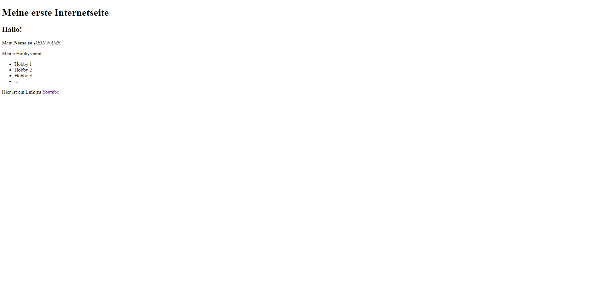

# Kapitel 1.3 - HTML Aufgabe
Nachdem du nun Kapitel 1 gelesen und verinnerlicht hast, ist es nun deine Aufgabe eine kleine eigene Internetseite zu erstellen. Hierfür erstellst du einen Ordner an einer beliebigen Stelle deines PC's und erstellst dort eine ```internetseite.html``` Datei. Diese kannst du auch schon direkt mit deinem Internetbrowser, deiner Wahl, öffnen. Beachte, dass du die Dateiendungen in Windows aktiviert hast, damit du die Dateiendung **.html** nutzen kannst. <br>
Um die HTML-Datei zu bearbeiten, nutzen wir [Visual-Studio-Code](https://code.visualstudio.com). Dies ist ein Codeeditor, welcher zu den beliebtesten im Webbereich gehört. Ist dieser geöffnet, kann über **File>Open Folder** der Ordner ausgewählt und die HTML-Datei bearbeitet werden. Es ist auch möglich, die HTML Datei über den hauseigenen Editor von Windows zu bearbeiten. Dies ist jedoch nicht zu empfehlen, da dort Fehler schwieriger zu finden sind. <br>
Die Aufgabe ist es nun, eine Internetseite mit HTML-Grundgerüst zu erstellen, welche folgenermaßen aussieht:

Versuche dabei so wenig Hilfsmittel, wie möglich, zu nutzen. Solltest du nicht weiter kommen, schau dir nicht direkt die Lösung an! Bei Tag-Name-Schwierigkeiten nutze am besten die Tabelle unter [Kapitel 1.1 - HTML Elemente](Kapitel%201.1%20-%20HTML%20Elemente.md). Sollte dies nicht weiterhelfen, schau dir nochmal [Kapitel 1.2 - HTML Grundgerüst](./Kapitel%201.2%20-%20HTML%20Grundger%C3%BCst.md) an. Solltest du damit immer noch nicht weiter kommen, kannst du nun schon lernen, wie man präzise sein Problem mit Stichwörtern beschreibt und googelt, um an die Lösung des Problems zu kommen. Bei Bedarf, kann natürlich auch eine KI, wie [Chat GPT](https://chat.openai.com) dabei helfen. **Versuche dabei jedoch nicht nur zu kopieren, sondern auch zu verstehen!**

[Zurück](./Kapitel%201.2%20-%20HTML%20Grundger%C3%BCst.md)
[Home](../README.md)
[Weiter (LÖSUNG)](./Kapitel%201.3.1%20-%20HTML%20Aufgabe%20L%C3%B6sung.md)